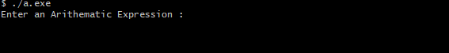
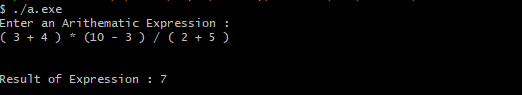

# COMPILER-BASIC-DESIGN

*COMPANY* : CODETECH IT SOLUTION

*NAME* : MOHIT GAJJAR

*INTERN ID* : CT04DF386

*DOMAIN* : C++ PROGRAMMING

*DURATION* : 4 WEEKS

*MENTOR* : NEELA SANTOS

## Features

- Supports:
  - Addition (`+`)
  - Subtraction (`-`)
  - Multiplication (`*`)
  - Division (`/`)
  - Parentheses for grouping
- Handles operator precedence correctly (`*` and `/` have higher precedence than `+` and `-`)
- Skips unnecessary whitespaces
- Detects invalid expressions
- Reports division-by-zero error
- Easy to extend into a full-featured expression compiler or calculator

---

## Logic Behind Code

The evaluator uses **Recursive Descent Parsing**, a top-down parsing technique used in compiler design.

## Function

Each function corresponds to a grammar rule:
- `expression()` → Handles `+` and `-`
- `term()` → Handles `*` and `/`
- `factor()` → Handles numbers and parenthesis
- `getnum()` → Converts string digits to integer

---

## Technologies Used

- (Standard Library)

- Visual Studio Code (VS Code)

- MSYS2 UCRT64 Terminal

- AI Assistant (ChatGPT)

---

## Input-Output

- The output after execution of exe file.

    

- The output after entering the expression.

    

